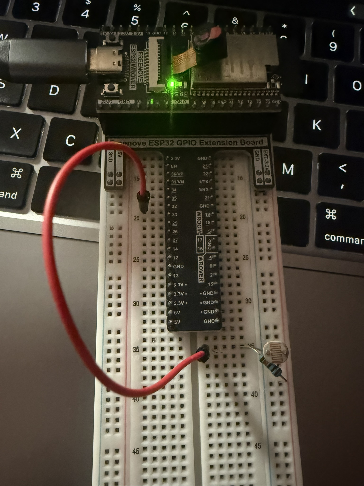
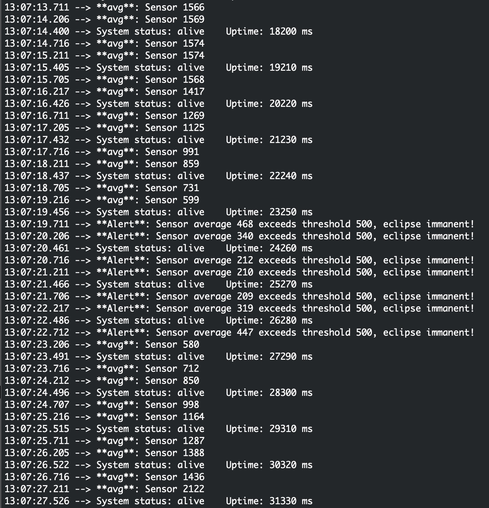

# Application 2 Preemptive Scheduling with Sensor Integration (FreeRTOS on ESP32)

## Analysis/Engineering

## Q1 Task Timing and Jitter:
The sensor task stays at it's 500ms like it's supposed to and the other tasks are allowed to drift and not be precise since their timing isn't as important as getting an accurate sensor average time. The sensor task is way more consistent because vTaskDelayUntil uses an absolute timestamp to calculate the next wake-up. This accounts for the time it takes to actually run the code, so it stays locked at 500ms. On the other hand, the LED and print tasks use vTaskDelay, which is just a relative delay. Since that delay only starts after the task finishes its work, and the high-priority sensor task can jump in and delay them/case jitter, they’ll eventually drift off schedule. Basically, vTaskDelayUntil stays on time every time while vTaskDelay slowly slips over time as the other tasks interrupt them.

## Q2 Priority-Based Preemption: 
Because the sensor task is Priority 3 and the print task is Priority 0, FreeRTOS will always prioritize the sensor. If the sensor’s timer hits while the print task is mid-sentence, the scheduler instantly pauses the print task to let the sensor run. Even if they both become "Ready" at the exact same time, the scheduler will pick the sensor task every time. For example, if the print task is running at Tick 1000 and the sensor wakes up at Tick 1005, the print task gets kicked off the CPU immediately and has to wait until the sensor is done to finish its line.

## Q3 Effect of Task Execution Time: 
If the sensor task suddenly took 300ms to run, it would hog the CPU and leave almost no time for the LED or print tasks to do anything. If the execution time ever exceeded the 500ms period, the system would totally break because the sensor task would never block, effectively starving everything else. You’d see missed readings, the LED would stop blinking, and the console would go silent. To fix this, I’d need to optimize the code, lower the sensor’s priority so it doesn't kill the system, or just pin it to the other ESP32 core.

## Q4 vTaskDelay vs vTaskDelayUntil:
I used vTaskDelayUntil for the sensor because it prevents "creeping" timing errors. With a regular vTaskDelay(500), the actual time between samples is 500ms plus whatever time it took to process the data, which adds up fast over thousands of loops. vTaskDelayUntil fixes this by making the period a fixed interval from the last start time. For the LED, vTaskDelay is fine because it doesn't really matter if a status light drifts by a few milliseconds—no one’s going to notice a tiny bit of jitter on a blinking light.

## Q5 Thematic Integration Reflection: 
In a Space Systems context, the sensor task is keeping track of the ambient light levels from the sun, this needs to happen at a consistent interval so the station can predict it's power generation vs it's power draw. If that is not accurate and at a consistant interval then they can't actively predict what what their current draw has to be to not deplete the on board batteries, if they can predict it then they know what machines can be turned off to increase the lifespan of the battery. On the other hand, the LED is like a basic telemetry heartbeat, it’s good to have, but it’s not the end of the world if it’s a little late. The print task is just low-priority diagnostic logging that the satellite only sends back to Earth when it has nothing better to do. This ensures the mission-critical stuff always happens first.

## Q6 Bonus
I caused starvation by wrapping the sensor math in a massive loop and dropping the period to 10ms using the bonus define macro. Since it’s Priority 3, it just eats up all the CPU cycles and never lets the lower-priority LED or print tasks run. The result is that the LED stops flashing and the console stops printing "System status: alive" entirely. Uncomment the define bonus line at the top to activate starvation mode, I chose a period of 10ms so the default 100hz tick timer is able to process it and not throw an assertion.
