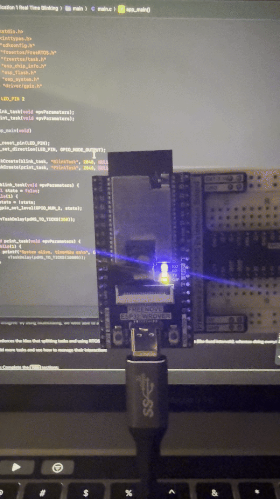

# Application 1 Intro to Real Time Blinking
# Analysis/Engineering

# Q1

## Does anything happen to the LED if you increase the delay within the print task? 
Nothing happens as it just increases the amount of time the print task is sleeping.

## What if you increase the number of characters printed? 
I was not able to observe any noticeable effect.

# Q2
## Describe the behavior you observed.
While my serial monitor was now flooded, I didn't notice any difference with the timing of the LED.

# Q3
## Assume you were a developer of one of these applications - might there be some considerations that you would want to take into consideration in how verbose (or not) you want your messages to be? 
There is definitely a consideration to be made, you have to decide what information is most important for a user to look at at a glance. If there's too much happening then all the information in the world will not help you quickly find what you are looking for in an emergency.
## Additionally, explain why this system benefits from having correct functionality at predictable times.
It benefits from being predictable because you know if it's acting in a manner outside of that prediction then there is something wrong with it.

# Q4
## a. Describe how you measure the periods:
I turned on timestamps in my serial monitor and verified they were all within tolerance of where they should be and stayed fairly accurate over a period of time.
## b. LED blink task period:
250ms state change (500ms led blink)
## c. Print task period:
10 seconds

# Q5
## Did our system tasks meet the timing requirements?
Yes
## How do you know?
Based on the timestamps in the serial monitor.
## How did you verify it?
Sampled it for a period of time and made sure it didn't drift.

# Q6
## If the LED task had been written in a single-loop with the print (see baseline super-loop code), you might have seen the LED timing disturbed by printing (especially if printing took variable time).
## Did you try running the code?
Yes
## Can you cause the LED to miss it's timing requirements?
Yes, if the print statement takes longer than it should becuase it's not switching timeslices like it would with separate tasks if could easily be off.

# Q7
## Do you agree or disagree: By using multitasking, we were able to achieve timing determinism for the LED blink. Why or why not?
Yes I agree, because I was easily able to see that the led was able to blink in a predictable manner. The print statement was able to stay in sync after a long period and it didn't stray from what I would expect it to be.
