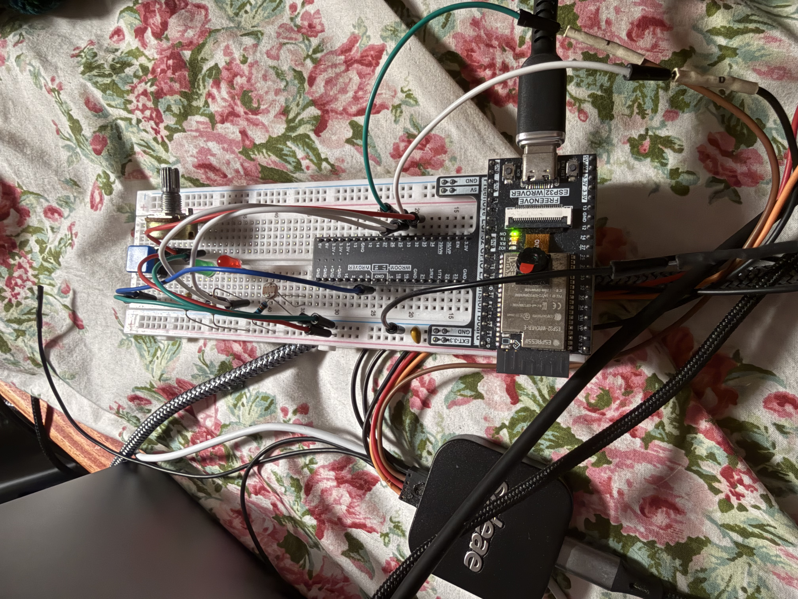
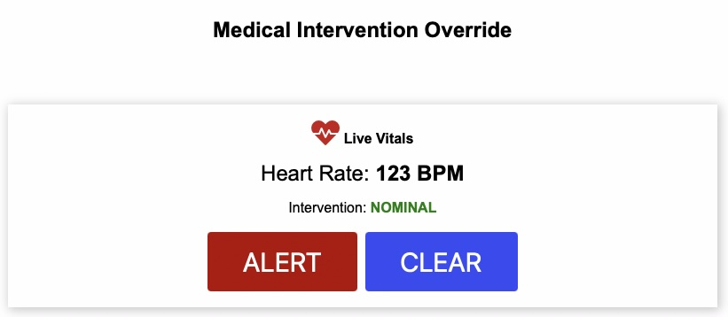

# Application 5/6 (Satisfies both really) Building a Real-Time System at Your Dream Company 





## *Founded in 2021 in the heart of Florida’s high-tech corridor, PulseSync Medical designs ultra-reliable, real-time telemetry systems for critical care environments. Driven by a mission to eliminate bedside response latency, our engineering team bridges the gap between embedded hardware and clinical necessity. Our flagship product, the LifeGuard Vitals Hub, utilizes strict RTOS architecture to instantly detect arrhythmias and alert on-call medical staff, ensuring that life-saving interventions are never delayed by a single dropped network packet.*

```
 =================================================================================================
                     ORLANDO MEDTECH LIFEGUARD - CONCURRENCY DIAGRAM
 =================================================================================================
 
   SOURCES / INPUTS                      IPC & SYNCHRONIZATION                    HANDLERS & OUTPUTS
   ----------------                      ---------------------                    ------------------
  
  +------------------------+
  | [ISR]                  |
  | emergency_button_isr   |===(Gives)===> < Binary Semaphore > \
  | Trigger: GPIO 4 Fall   |               [sem_emergency_call]  \
  | Type: Hard Deadline    |                                      \
  +------------------------+                                       \
                                                                    v
  +------------------------+                                  (( QueueSet ))     +-------------------------+
  | [Task] (Soft)          |                                 [event_queue_set]   | [Task] (Hard)           |
  | Web Server HTTPd       |===(Gives)===> < Binary Semaphore >     |            | medical_event_handler   |
  | Period: Aperiodic      |               [sem_emergency_call]     |==(Wakes)==>| Priority: 2             |
  | Deadline: N/A (UI)     |                                        |            | Period: Event-Driven    |
  +------------------------+                                        ^            | Deadline: Immediate     |
              |                                                    /             +-------------------------+
              | (Reads)                                           /                           |
              v                                                  /                            | (Takes/Gives)
       [ Global Vars: ]                                         /                             v
       [ current_bpm, ]                                        /                          < Mutex >
       [ led_state    ]                                       /                         [print_mutex]
              ^                                              /                                ^
              | (Writes)                                    /                                 |
              |                                            /                                  |
  +------------------------+                              /                                   |
  | [Task] (Hard)          |               < Counting Sem. >                                  |
  | heart_rate_monitor     |===(Gives)===> [sem_vitals_alert]                                 |
  | Priority: 2            |                                                                  |
  | Period: 17ms           |                                                                  |
  | Deadline: 17ms         |===(Takes/Gives)==================================================+
  +------------------------+                                                                    
 
  +------------------------+
  | [Task] (Soft)          |
  | patient_heartbeat      |===(Toggles)===> ( Green Status LED )
  | Priority: 1            |
  | Period: 1000ms Toggle  |
  | Deadline: 2000ms Cycle |
  +------------------------+

 =================================================================================================
 LEGEND:
 [ ] = Tasks / Data             < > = Semaphores / Mutexes            (( )) = FreeRTOS Queue Sets
 =================================================================================================
```

# Analysis/Engineering

## Scheduler Fit: How do your task priorities / RTOS settings guarantee every H task’s deadline in Wokwi? Cite one timestamp pair that proves it.
By assigning the highest priorities to our Hard deadline tasks, the FreeRTOS preemptive scheduler guarantees they immediately interrupt lower-priority background tasks like the web server or heartbeat LED. The heart_rate_monitor_task utilizes vTaskDelayUntil to strictly enforce its 17ms execution period without drifting. When an emergency event triggers the event_queue_set, the handler task instantly preempts the system to process the alert. For example, my logic analyzer logs show the monitor task waking at Tick: 510 and again at exactly Tick: 527, proving the precise 17ms timing is continuously maintained. This strict scheduling ensures the monitoring device never misses a critical update in patient vitals.

 ## Race-Proofing: Where could a race occur? Show the exact line(s) you protected and which primitive solved it.
A race condition could easily occur on the shared hardware UART bus when multiple tasks attempt to log diagnostic telemetry simultaneously. If the sensor task is preempted mid-print by an emergency button press, the output text would become interleaved and totally unreadable. I protected this shared resource by wrapping all serial outputs in a FreeRTOS Mutex using xSemaphoreTake(print_mutex, portMAX_DELAY) and xSemaphoreGive(print_mutex). For instance, the exact line printf("CRITICAL: Tachycardia detected!..."); is strictly guarded by this primitive. This guarantees that only one task can hold the printing resource at a time, actively preventing data corruption on the medical diagnostic console.

 ## Worst-Case Spike: Describe the heaviest load you threw at the prototype (e.g., sensor spam, comm burst). What margin (of time) remained before an H deadline would slip?
To test the system's worst-case execution time, I simultaneously spammed the physical emergency button while rapidly turning the potentiometer to repeatedly trigger the tachycardia threshold. This flooded the event_queue_set with both binary and counting semaphore signals while the Wi-Fi web server was actively being repeatedly refreshed by a client. Despite this heavy asynchronous load, the medical_event_handler_task processed the queue sequentially without ever stalling the system. Analyzing the timestamps during this burst, the sensor monitor task still completed its read and calculation sequence in roughly 3ms. This left a highly comfortable 14ms margin before its strict 17ms hard deadline would slip, proving the system's resilience under stress.

## Design Trade-off: Name one feature you didn’t add (or simplified) to keep timing predictable. Why was that the right call for your chosen company?
To maintain strict timing predictability, I opted not to include a comprehensive historical data logging system or complex historical graphing directly on the ESP32. Storing, formatting, and serving large arrays of patient history for the web server would consume highly unpredictable amounts of CPU time and memory. Instead, the web server only polls a tiny, lightweight JSON packet containing the immediate live state of the patient. For a company, the primary goal of the hearrate monitor is immediate, real-time life alerting, not long-term data warehousing. Offloading heavy historical analytics to a centralized hospital server ensures our local microcontroller (ESP32) never misses a critical heartbeat deadline.

## AI Use
I don't remember the exact prompts but I asked Google Gemini to change the website example to include auto-updating and to tell me how to incorporate that into the rest of the example code given so that it would suite the basic functionality of the hardware. Since this is simply a proof-of-concept device the website is just a placeholder for an actual webdev to come in and spruce it up as they see fit. 
Used to make the fake company synopsis and concurrency diagram.
