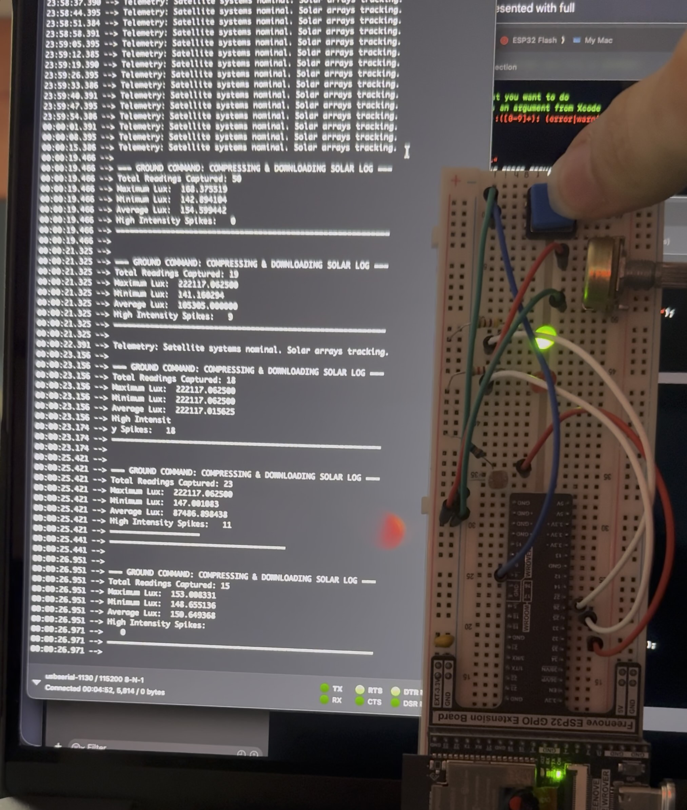

# Application 3 Interrupt-Driven Task Synchronization in FreeRTOS (ESP32)

Bonus:
A minor delay in the logger task  and disabling the interrupt until the log has been made handles potential mechanical bouncing on the button to prevent immediate re-triggering of the semaphore
Better to implemenet harware debugging with a low-pass filter and schmitt trigger for more robustness
Wokwi may not be able to do this if they have have not implemented the ability to simulate capacitors and resistors interacting to form a low-pass filter
Or if they don't have any schmitt trigger components, some microcontrollers have those built-in to their digital inputs that you can turn on and use
I'm uncertain if the ESP32 itself has those specifically or not though.

## Analysis/Engineering

## Q1 Polling vs. Interrupt: Why is ISR + semaphore more efficient than polling? What polling problems does this avoid?
For ISR vs polling specifically it guarentees the button is read immediately no matter what is happening assuming something with a higher priority isn't already interrupting. Now pairing that with a semaphore lets you schedule more complex code to be run in a separate tasl than you would typically want to run in an ISR on it's own since you want to keep that to a minimum so you aren't blocking other tasks.

## Q2 ISR Design: Why must we use FromISR APIs inside an ISR? What could go wrong with a regular blocking call (e.g. xSemaphoreTake) in an ISR?
FromISR APIs are handled differently from standard blocking APIs because an ISR runs in a different context from normal code and thus has to be handled differently. If you use the normal API and try to block inside an ISR you can end up causing your code to crash since there is no way to block an ISR like you can with normal tasks.

## Q3 Real-Time Behavior: The LightSensorTask is running when the button is pressed. Describe what happens: interrupt priority, xHigherPriorityTaskWoken/portYIELD_FROM_ISR, task priorities. Does the logger preempt immediately or wait? Why? 
When the button is pressed, the hardware instantly interrupts the Priority 2 LightSensorTask and runs the ISR. Inside the ISR, giving the semaphore unblocks the Priority 3 LoggerTask and sets xHigherPriorityTaskWoken to true, so when portYIELD_FROM_ISR is called, the scheduler forces an immediate context switch, meaning the logger preempts the sensor task instantly without waiting.

## Q4 Core Affinity: If tasks weren't pinned to Core 1, what nondeterministic behaviors might occur? What benefits did single-core pinning provide?
If tasks weren't pinned to Core 1, the ESP32's dual-core scheduler would dynamically migrate tasks between cores, introducing nondeterministic timing, cache misses, and unpredictable race conditions. Pinning all tasks to a single core ensures a highly predictable, time-sliced execution environment where task preemption behaves exactly according to assigned priorities.

## Q5 Light Sensor Logging: How did you handle data sharing between sensor and logger tasks? What issues could arise if the logger preempts mid-write, and how could they be mitigated? 
Data was shared between the sensor and logger tasks using a globally scoped circular array and shared index variables. If the higher-priority logger task preempts the sensor task exactly halfway through writing a new value and updating its index, the logger could transmit corrupted or misaligned data. This race condition can be mitigated by wrapping the array operations in a critical section or by passing data through a thread-safe FreeRTOS Queue.

## Q6 Task Priorities: If LoggerTask had priority 1 and Blink had priority 3, what happens on button press? Relate to preemptive scheduling and priority inversion. 
If the LoggerTask was assigned priority 1 and the Blink task priority 3, an urgent ground command would trigger the semaphore but the logger would not immediately preempt the system. Instead, it would suffer from priority inversion, forced to wait until the less critical blinking and sensor tasks finished their execution cycles and entered a blocked state before it could process the event.

## Q7 Resource Usage: List two reasons for minimizing ISR work. Connect to this lab. 
ISRs must be kept as short as possible because while they run, all standard RTOS task execution is completely frozen, and spending too much time in an ISR can cause the system to drop other critical hardware interrupts. In this lab, we minimized ISR work by keeping the slow string formatting and mathematical compression loop entirely out of the interrupt context, deferring that heavy lifting to the RTOS logger task.

## Q8 Chapter Connections: Identify one concept from Mastering FreeRTOS Ch. 7 or Practical RT Systems Ch. 8 you applied. Quote/paraphrase and explain.
This assignment actively applies the concept of "Mutual Exclusion using Mutexes" (Chapter 7.3). By wrapping all printf statements in the console and logger tasks with xSemaphoreTake and xSemaphoreGive using a dedicated print_mutex, the system safely manages access to the shared UART hardware. This ensures that if a high-priority task preempts a lower-priority task mid-print, it temporarily blocks on the mutex instead of scrambling the terminal output with overlapping text.
